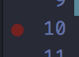
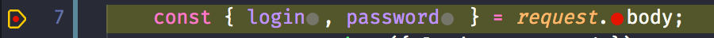
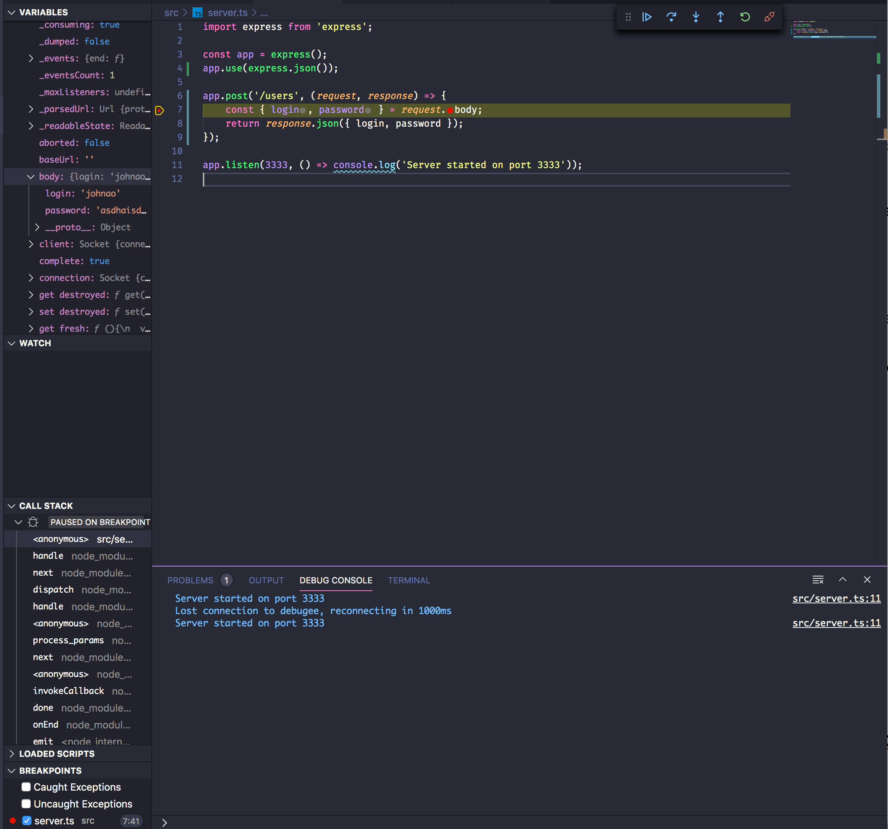
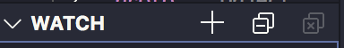
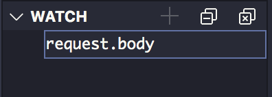
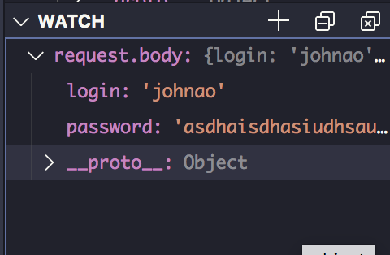
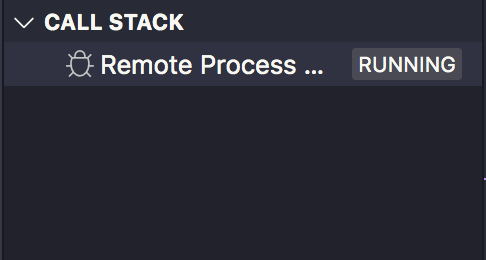
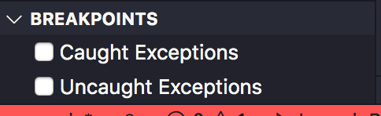

# Padrões

## EditorConfig for VS Code

* **Para garantir que configurações do editor ou até editores diferentes causem problemas, instalaremos no vcsoce a extensão `EditorConfig for VS Code`.**
* Após isso, **botão direito no explorador de arquivos e clique na última opção (Generate .editorconfig)**. Irá gerar um arquivo .editorconfig.
* Definimos os seguintes parâmetros: `trim_trailing_whitespace = true`, `insert_final_newline = true` e `end_of_line = lf`. Irá garantir que o código seja formatado corretamente.

## ESLint


Responsável pelos *padrões de códigos* em NodeJS, ReactJS e React Native (Como a definição do uso da vírgula, por exemplo). É disponível em outros editores.


* Instalar a extensão `ESlint` no VSCode.
* Atribuir uma configuração no VSCode que formate o código sempre que for salvo. Para isso, após instalado o ESlint, usamos a config:
```json
"editor.codeActionsOnSave": {
  "source.fixAll.eslint": true
}
```
* Instalar o package esling no node com `yarn add eslint@6.8.0 -D` (Usamos essa versão pois versões a partir da 7 estão com problemas de incompatibilidade [oq é irônico pra um package que trata justamente de compatibilidade anyway]).
* `yarn eslint --init` no terminal, com as opções:
  * To check syntax, find problems and enforce code style | Para fazer todas as verificações
  * Javascript modules (import/export) | Autoexplicativo
  * None of these |Autoexplicativo
  * y | Autoexplicativo
  * Node (Tecla espaço tira a seleção da opção 'Browser') | Autoexplicativo
  * Use a popular style guide | Para usar um padrão de projeto criado por uma empresa
  * Airbnb (Opção que garante a obrigatoriedade do uso da vírgula, áspas simples e outras configs)
  * JSON
  * n | pois estamos utilizando o *Yarn*
* Instalar as libs manualmente: `yarn add @typescript-eslint/eslint-plugin@latest eslint-config-airbnb-base@latest eslint-plugin-import@^2.21.2 @typescript-eslint/parser@latest -D`
* Com as dependências criadas, precisamos ignorar alguns arquivos, então adicionamos um arquivo no projeto chamado `.eslintignore`. Para ignorar a pasta node_modules, dist e todos os arquivos .js (já que estamos usando Typescript). A estrutura ficará:
```
/*.js
node_modules
dist
```
* No arquivo *.eslintrc.json*, dentro de "extends" adicionamos a linha `"plugin:@typescript-eslint/recommended"`.
* Como estamos trabalhando com typescript que as importações de arquivos Typescript não foram resolvidas, para corrigir isso, usamos a biblioteca *eslint-import-resolver-typescript* em modo de desenvolvimetno, então é só usar `yarn add eslint-import-resolver-typescript -D` no terminal e é sucesso!
* Agora precisamos falar para o eslint que arquivos .tsx não precisam da extensão do arquivo, inserindo nas "rules" do arquivo .eslintrc.json o trecho:
```
"import/extensions": [
    "error",
    "ignorePackages",
    {
        "ts": "never"
    }
    ]
```

Ainda em Rules, definimos como não obrigatório arrow functions que sejam expressões:

```
"@typescript-eslint/explicit-function-return-type": [
  "error",
  {
    "allowExpressions": true
  }
]
```


*E logo abaixo das Rules, insira o trecho (com uma vírgula antes óbvio):

```
"settings": {
    "import/resolver": {
        "typescript": {}
    }
    }
```
* Feche e abra o VSCode e vualá.


## Prettier


Iremos usar o Prettier para que o código seja formatado para seguir um padrão (Ex. quando uma linha de código passa de mais de 80 caracteres, ele quebra a linha).


**OBS: Antes de instalar o Prettier, se seu VSCode tiver a extensão *Prettier - Code Formatter* instalada, remova, pois cria incompatibilidades**


* `yarn add prettier eslint-config-prettier eslint-plugin-prettier -D` no terminal. Ela irá fazer não só a formatação como a integração com o ESlint.
* Adiconaremos duas regras na aba "extends" do .eslintrc.json:
```
"prettier/@typescript-eslint",
"plugin:prettier/recommended"
```
* Ainda no .eslint.json, em "plugins" inserimos `"prettier"`
* Adicionamos o trecho `"prettier/prettier": "error"` em "rules" para que o ESLint mostre os erros que o prettier identificar.
* Agora precisamos corrigir os problemas de conflitos, para issom criamos um arquivo *"prettier.config.js"* na raiz do arquivo, inde adicionaremos as regras *singleQuote* (Para usar àspas simples), *trailingComma* (Adiciona uma vírgula em todo objeto que for quebrado por linhas) e *arrowParens* (Para que não seja adicionado parênteses quando uma arrow function tiver apenas um parâmetro). Ficará assim: :
```
module.exports = {
    singleQuote: true,
    trailingComma: 'all',
    arrowParens: 'avoid'
}
```
* Para terminar, verificamos se o trecho "/*.js" está no arquivo ".eslintignore", para garantir só.


Feito isso, seu projeto já estará seguindo o padrão de todos os desenvolvedores!


---


# Debugando NodeJS com o VS Code

No VS Code no painel do canto esquerdo normalmente temos um botão com o símbolo de play e um inseto (Normalmente o quarto botão de cima pra baixo), é o painel de debug.


No painel de debug, clicamos em **create a launch json file**. Caso ele não reconheça a linguagem automaticamente, selecionamos o NodeJS nas opções que ele nos dá.


* Mudamos o parâmetro *request* para `attach`.
  * Ao executar o Degug (após ter iniciado a aplicação), o modo "attach" irá tentar se conectar com a aplicação. Caso contrário, o modo "launch" irá rodar a aplicação assim que rodar o Debug. É melhor pois debugamos apenas quando precisamos e não precisamos resetar toda hora a aplicação.
* Name fica a seu critério, coloquei `Debug`.
* O parâmetro *program* podemos remover
* Abaixo de "request", inserimos um parâmetro *protocol*, e definimos como `inspector`
  * Forma de inspencionar o NodeJS. Como o código está no node, precisamos definir dessa forma.
* Abaixo do "protocol", inserimos um parâmetro *restart*, e definimos como `true`


Ao executar `yarn dev:server` e executar o Debug ele não irá se conectar, **para isso, precisamos inserir uma flag no script `dev:server` chamada inspect (--inspect), o script ficará: `ts-node-dev --inspect --transpile-only --ignore node_modules src/server.ts`**.


Executando o script podemos ver uma linha no terminal semelhante a *Debugger listening on ws://algumacoisa...* significa que já podemos Debugar. Ao iniciar o Debug irá aparecer a mensagem "Debug Attached" no terminal.

## Trabalhando com o Debug.


Suponha que vamos debugar a rota users ("/users") do tipo post, que retorne o usuário com login e password:


```javascript
app.post('/users', (request, response) => {
    const { login, password } = request.body;
    return response.json({ login, password });
});
```


Ao fazer uma requisição do tipo POST no insomnia, irá dar um erro, que a variável login não é reconhecida. Então normalmente tentaríamos que dar um `console.log(login)` para ver qual o valor. Então, usando o Debug, Entre a aba de códigos e o explorador de arquivos, vemos a quantidade de linhas, **que ao passar o mouse sobre cada linha vemos uma bolinha vermelha** (Esses são chamados de BreakPoints).



Então, se a gente quer ver o conteúdo de "request.body", clicamos na linha onde a variável login e password é desconstruída, então o código irá parar nela. Ao salvar o código e executar a requisição novamente, o código irá parar e a requisição ficará em espera até decidirmos continuar:





 O VSCode já mostra a variável no painel do Debug.





Conseguimos abrir todas as variáveis e observar se já conseguimos observar o problema. Ainda é possível observar uma variável em tempo real com o painel "Watch".


Para adicionar uma variável no painel, clique no "+":








Agora, estamos observando o valor dela em tempo real.





Podemos então identificar o problema. O Debug mostra não só as variáveis locais, como globais (Classes do JS etc).


**Podemos ver todos os arquivos e funções executado(a)s para processar a requisição na aba callstack.**





Na aba *breakpoints* podemos remover um breakpoint manualmente ou podemos capturar exceções cairem como breakpoints, para quando acontecer entendermos oq aconteceu.


